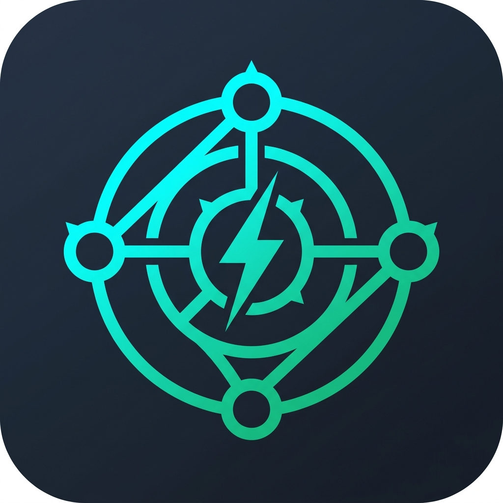

<div align="center">



# LinkShare

**High-Performance LAN & Wi-Fi Direct Peer-to-Peer File Sharing**

[](https://developer.android.com)
[](https://kotlinlang.org)
[](LICENSE)
[](https://github.com/Flaxmbot/LinkShare/actions)

<br/>

100% Offline &middot; Zero Cloud &middot; Privacy First

---

</div>

## Overview

LinkShare is an open-source, privacy-first file sharing suite for ultra-fast transfers across local area networks and Wi-Fi Direct. It runs entirely offline with no cloud servers, external accounts, or internet connection required.

---

## Features

| Feature | Description |
| :--- | :--- |
| **ShareMe App Extractor** | Extract installed APKs and share over LAN in one tap |
| **WebDAV Gateway** | Mount internal storage as a network drive on TVs, Kodi, Finder |
| **FTP Server** | Full storage access from Windows Explorer, Finder, or any FTP client |
| **LAN Clipboard** | Real-time cross-device text copy-paste |
| **Media Streaming** | HTML5 video/audio with HTTP 206 partial content and PDF viewing |
| **Dual-Link Bonding** | Aggregate Wi-Fi + Wi-Fi Direct channels simultaneously |
| **Swarm P2P** | Multi-peer parallel piece distribution with SHA-256 verification |
| **Access Control** | 4-digit PIN, Bearer Token auth, bandwidth cap, and JSON audit logs |

---

## Architecture

<div align="center">


</div>

---

## Download

Get the latest release APK from the [Releases](https://github.com/Flaxmbot/LinkShare/releases) page.

| Platform | File | Requirements |
| :--- | :--- | :--- |
| Android | `LinkShare-v1.0.0-android.apk` | Android 7.0+ (API 26) |

---

## CLI Reference

LinkShare includes a headless server daemon for Linux servers and Raspberry Pi deployments.

### Usage

```bash
java -cp linkshare.jar app.linkshare.cli.LinkShareCli \
  --port 8080 \
  --ftp-port 2121 \
  --dir /storage/emulated/0 \
  --pin 4821 \
  --timeout 15 \
  --speed 50
```

### Options

| Flag | Alias | Description | Default |
| :--- | :--- | :--- | :--- |
| `--port <port>` | `-p` | HTTP/WebDAV server port | `8080` |
| `--ftp-port <port>` | | FTP server port | `2121` |
| `--dir <path>` | `-d` | Root shared directory | `/storage/emulated/0` |
| `--pin <pin>` | | 4-digit access PIN | Random |
| `--timeout <mins>` | | Auto-disconnect timeout (minutes) | `0` (disabled) |
| `--speed <mbps>` | | Bandwidth cap (MB/s) | `0` (unlimited) |
| `--help` | `-h` | Show help | |

---

## Linux Service

Register LinkShare as a systemd service:

```ini
# /etc/systemd/system/linkshare.service
[Unit]
Description=LinkShare LAN File Daemon
After=network.target

[Service]
ExecStart=/usr/bin/java -cp /opt/linkshare/linkshare.jar app.linkshare.cli.LinkShareCli --port 8080 --ftp-port 2121 --dir /srv/share --pin 4821
Restart=always
User=root

[Install]
WantedBy=multi-user.target
```

```bash
sudo systemctl daemon-reload
sudo systemctl enable --now linkshare
```

---

## Building from Source

### Prerequisites

- JDK 17+
- Android SDK 34

### Build

```bash
git clone https://github.com/Flaxmbot/LinkShare.git
cd LinkShare
./gradlew assembleRelease
```

The APK will be at `app/build/outputs/apk/release/`.

### Test

```bash
./gradlew test
```

---

## REST API

<details>
<summary><b>View Endpoints</b></summary>

<br/>

| Method | Endpoint | Description |
| :--- | :--- | :--- |
| `GET` | `/api/status` | Server health, ports, session PIN, Bearer token |
| `GET` | `/api/browse?path=/` | Directory listing with sizes and timestamps |
| `GET` | `/api/stream?path=/file` | Media streaming with HTTP 206 range support |
| `POST` | `/api/upload` | Multipart file upload |
| `GET` / `POST` | `/api/clipboard` | Read or sync LAN clipboard |

</details>

---

<div align="center">

Licensed under the [Apache License 2.0](LICENSE).

</div>
