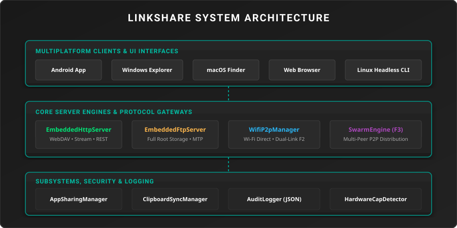

<div align="center">


# LinkShare

**High-Performance Multiplatform LAN & Wi-Fi Direct File Sharing**

[](https://developer.android.com)
[](https://microsoft.com)
[](https://apple.com)
[](https://kernel.org)
[](https://kotlinlang.org)
[](LICENSE)
[](https://github.com/Flaxmbot/LinkShare/actions)

<br/>

100% Offline &middot; Multiplatform &middot; Zero Cloud &middot; Privacy First

---

</div>

## Overview

LinkShare is a multiplatform, privacy-first file sharing suite powered by **Kotlin Multiplatform (KMP)** and **Compose Multiplatform**. It enables ultra-fast transfers across local area networks and Wi-Fi Direct on Android, Windows, macOS, Linux, and iOS with no cloud servers or internet connection required.

---

## Features

| Feature | Description |
| :--- | :--- |
| **Windows 11 File Explorer Web Portal** | Full-featured responsive web portal styled after Windows 11 File Explorer with context menus, search, sorting, drag & drop, and media players |
| **Native Media Players & Viewers** | Built-in HTML5 video, audio, image, and document viewers for instant streaming |
| **WebDAV Gateway** | Mount shared directories as native network drives on Windows, macOS Finder, or Kodi |
| **FTP Server** | RFC 959 compliant FTP access from Windows Explorer, Finder, or any FTP client |
| **LAN Device Discovery** | Pulsing radar network scanner & manual IP connection with port guidance |
| **Universal LAN Clipboard** | Real-time cross-device text copy & paste sync |
| **Swarm P2P** | BitTorrent-style multi-peer piece distribution with SHA-256 integrity verification |
| **Directory Mounting** | Easily select and mount any directory on your device to share over LAN |
| **Security & Privacy** | 4-digit PIN authentication, Bearer Token auth, and zero cloud tracking |

---

## Architecture

<div align="center">



</div>

---

## Downloads

Native installers are automatically generated for all platforms on each release:

| Platform | Installer / Package | Requirements |
| :--- | :--- | :--- |
| **Android** | `LinkShare-android.apk` | Android 7.0+ (API 26+) |
| **Windows** | `LinkShare-windows.msi` | Windows 10 / 11 (64-bit) |
| **macOS** | `LinkShare-macos.dmg` | macOS 12+ (Apple Silicon & Intel) |
| **Linux** | `LinkShare-linux.deb` | Ubuntu / Debian-based distros |

---

## Building from Source

### Prerequisites

- JDK 17+
- Android SDK 34 (for Android target)

### Build Commands

```bash
git clone https://github.com/Flaxmbot/LinkShare.git
cd LinkShare

# Run Desktop App locally
./gradlew :composeApp:run

# Build Android Release APK
./gradlew :composeApp:assembleRelease

# Package Windows MSI Installer
./gradlew :composeApp:packageMsi

# Package macOS DMG Installer
./gradlew :composeApp:packageDmg

# Package Linux DEB Installer
./gradlew :composeApp:packageDeb
```

---

## REST API

<details>
<summary><b>View Endpoints</b></summary>

<br/>

| Method | Endpoint | Description |
| :--- | :--- | :--- |
| `GET` | `/api/status` | Server status, active port, session PIN, and mounted directory |
| `GET` | `/api/browse?path=/` | Directory listing with file metadata, sizes, and timestamps |
| `GET` | `/api/stream?path=/file` | High-speed file streaming with HTTP 206 range request support |
| `POST` | `/api/upload` | Multipart file upload |
| `POST` | `/api/delete` | Delete file or directory |
| `GET` / `POST` | `/api/clipboard` | Read or sync LAN clipboard text |

</details>

---

<div align="center">

Licensed under the [Apache License 2.0](LICENSE).

</div>
